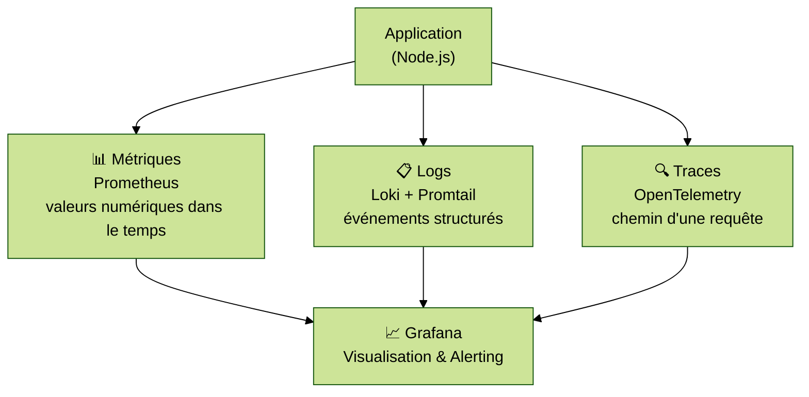

# Module 6 — Observabilité

---
level: 2
---

# Objectifs du module

- Comprendre la différence entre monitoring et observabilité
- Connaître les 3 piliers : métriques, logs, traces
- Définir des SLOs et error budgets
- Mettre en place une stack de monitoring sur l'application fil rouge

---
level: 2
---

# Monitoring vs Observabilité

| | Monitoring | Observabilité |
|---|---|---|
| **Question** | "Est-ce que ça marche ?" | "Pourquoi est-ce que ça ne marche pas ?" |
| **Approche** | Surveiller des seuils connus à l'avance | Explorer l'état interne à partir des sorties |
| **Focus** | Infrastructure (CPU, mémoire, ping) | Comportement du système (requêtes, transactions) |
| **Limite** | Aveugle aux problèmes inconnus | Nécessite une instrumentation thoughtful |

<div class="mt-4 bg-blue-50 border-l-4 border-blue-500 p-4 rounded">
  💡 <strong>CALMS — Mesure :</strong> on ne peut améliorer que ce qu'on mesure. L'observabilité est la fondation des décisions data-driven
</div>

---
level: 2
---

# Les 3 piliers de l'observabilité



---
level: 2
---

# Métriques — Prometheus

Prometheus collecte des **séries temporelles** (ex: nombre de requêtes HTTP, latence p99, usage CPU)

**Modèle pull :** Prometheus interroge (`scrape`) les applications à intervalles réguliers

```yaml
# docker-compose.monitoring.yml (extrait)
prometheus:
  image: prom/prometheus:latest
  volumes:
    - ./prometheus.yml:/etc/prometheus/prometheus.yml
  ports:
    - "9090:9090"
```

Types de métriques courants :
- **Counter** : valeur qui ne fait qu'augmenter (`http_requests_total`)
- **Gauge** : valeur instantanée (`memory_usage_bytes`)
- **Histogram** : distribution + percentiles (`http_request_duration_seconds`)

---
level: 2
---

# Logs — Loki + Promtail

**Loki** est un agrégateur de logs optimisé pour le coût : il n'indexe que les labels, pas le contenu.

**Promtail** est l'agent qui collecte les logs des conteneurs et les envoie à Loki.

```yaml
# Logs structurés (JSON) — recommandé
{"level":"info","method":"GET","path":"/api/health","status":200,"duration_ms":3}

# Logs non structurés — déconseillé
INFO  2026-03-23 GET /api/health 200 3ms
```

<div class="mt-4 bg-blue-50 border-l-4 border-blue-500 p-4 rounded">
  💡 <strong>CALMS Lean :</strong> des logs JSON sont requêtables (LogQL), des logs texte nécessitent du parsing coûteux
</div>

---
level: 2
---

# Traces — OpenTelemetry

Une **trace** représente le parcours complet d'une requête à travers tous les services.

```
Requête utilisateur
  └── API Node.js (120ms)
        ├── Requête PostgreSQL (45ms)
        └── Appel service externe (60ms)
```

**OpenTelemetry** est le standard ouvert pour instrumenter les applications (SDK disponibles pour Node, Python, Go, Java…)

Utile pour :
- Identifier les goulots d'étranglement
- Comprendre les erreurs dans un système distribué
- Mesurer les dépendances entre services

---
level: 2
---

# SLOs, SLIs, SLAs et error budgets

| Concept | Définition | Exemple |
|---|---|---|
| **SLI** (Service Level Indicator) | Métrique mesurée | % de requêtes < 200ms |
| **SLO** (Service Level Objective) | Objectif interne | 99,5 % des requêtes < 200ms |
| **SLA** (Service Level Agreement) | Engagement contractuel | 99 % de disponibilité mensuelle |
| **Error Budget** | Marge d'échec autorisée | 0,5 % × 30 jours = 3,6h d'indispo |

Principe : **on alerte sur l'impact utilisateur** (SLO en danger), pas sur les symptômes (CPU > 80%)

---
level: 2
---

# Bonnes pratiques — Observabilité

<div class="grid grid-cols-2 gap-4">

<div class="bg-green-50 border-l-4 border-green-500 p-3 rounded">
  <strong>✅ Faire</strong>
  <ul class="mt-2 text-sm">
    <li>Instrumenter dès le développement (shift-left observability)</li>
    <li>Définir les SLOs avant de configurer les alertes</li>
    <li>Logs structurés (JSON) → requêtables (CALMS Lean)</li>
    <li>Alerter sur le burn rate de l'error budget</li>
    <li>Dashboard as code (versionné, reviewable)</li>
  </ul>
</div>

<div class="bg-red-50 border-l-4 border-red-500 p-3 rounded">
  <strong>❌ Éviter</strong>
  <ul class="mt-2 text-sm">
    <li>Alertes sur les symptômes ("CPU > 80%")</li>
    <li>Logs non structurés ou trop verbeux</li>
    <li>On-call sans runbooks associés aux alertes</li>
    <li>Dashboards créés uniquement via l'UI (non reproductibles)</li>
    <li>Monitoring ajouté "une fois en prod"</li>
  </ul>
</div>

</div>

---
level: 2
---

# TP 6 — Stack de monitoring sur l'app fil rouge

**Objectif :** ajouter Prometheus + Grafana + Loki à l'application fil rouge

Voir https://github.com/mathieulaude/formation-devops > src/05-observability

**À explorer :**
1. Générer du trafic sur l'API : `watch curl -X GET http://localhost:3001/api/items`
2. Observer les métriques HTTP dans Prometheus
3. Lire les logs structurés dans Grafana → Loki
4. Créer une alerte sur le taux d'erreur HTTP > 1%

---
level: 2
transition: slide-right
---

# Débrief et validation

- Quelle est la différence entre une alerte sur CPU > 80% et une alerte sur SLO ?
- Pourquoi les logs structurés (JSON) sont-ils préférables ?
- Quel pilier aurait détecté en premier une requête SQL lente ?
